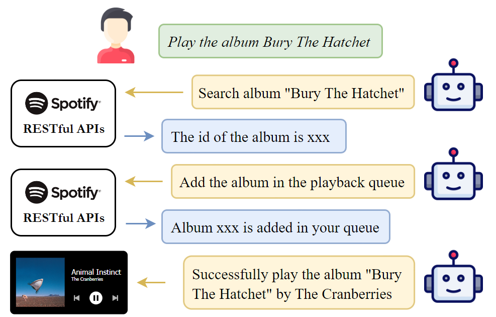
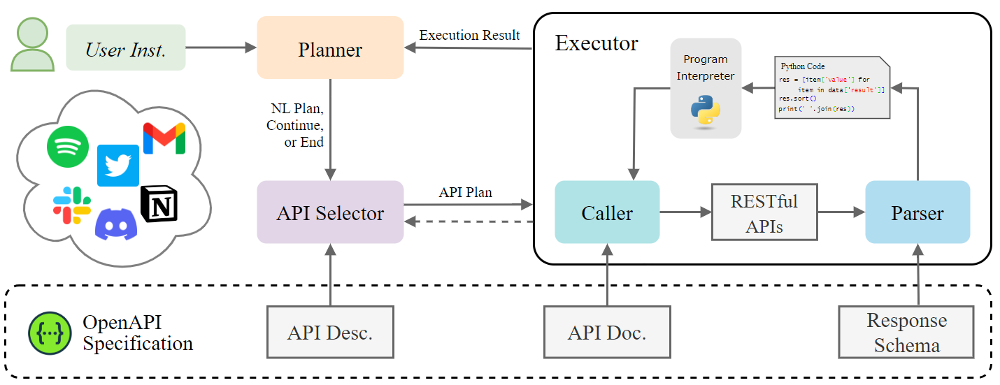

# RestGPT

This is the code for the paper [RestGPT: Connecting Large Language Models with Real-World RESTful APIs](https://arxiv.org/abs/2306.06624).

This work aims to construct a **large language model based autonomous agent, RestGPT, to control real-world applications**, such as movie database and music player. To achieve this, we connect LLMs with **RESTful APIs** and tackle the practical challenges of planning, API calling, and response parsing. To fully evaluate the performance of RestGPT, we propose **RestBench**, a high-quality test set which consists of two real-world scenarios and human-annotated instructions with gold solution paths.



## What's New

* **[Next]** The demo is under-construction.
* **[2023/8/29]** Code for RestGPT is released.
* **[2023/8/28]** The second version of our [paper](https://arxiv.org/abs/2306.06624) is released.
* **[2023/6/13]** Our [paper](https://arxiv.org/abs/2306.06624) is released.

## RestGPT

RestGPT adopts an iterative coarse-to-fine online planning framework and uses an executor to call RESTful APIs. Here is an overview of RestGPT.



Modules:

* Planner: generating natural language sub-task for current step.
* API selector: mapping the coarse high-level sub-task to finer API calling plan.
* Executor: executing the API calling plan.
    * Caller: organizing API parameters based on the API plan and API documentation.
    * Parser: generating Python code to parse the API response based on the response schema.

Here is an example of using TMDB movie database to search for the number of movies directed by Sofia Coppola.


## Data

We also introduce RestBench to evaluate the performance of RestGPT. RestBench is a high-quality test set consisting of TMDB movie database and Spotify music player scenarios. We collect realistic user instructions with human-annotated gold solution paths. Here are examples of RestBench:

TMDB example:

* Instruction: Who is the director of today's most trending movie?
* Gold solution path
    * GET /trending/\{media_type\}/\{time\_window\}
    * GET /movie/\{movie_id\}/credits

Spotify example:

* Instruction: Make me a playlist containing three songs of Mariah Carey and name it 'Love Mariah'.
* Gold solution path
    * GET /search
    * GET /me
    * POST /usres/\{user_id\}/playlists
    * POST /playlists/\{playlist_id\}/tracks

Below is the statistics of the data. We report the number of instructions with different lengths of solution path:

| Scenario | #APIs | Len-1 | Len-2 | Len-3 | Len-4 | Avg. Len. | Total |
| -------- | ----- | ----- | ----- | ----- | ----- | --------- | ----- |
| TMDB     | 54    | 5     | 66    | 27    | 2     | 2.3       | 100   |
| Spotify  | 40    | 8     | 18    | 22    | 9     | 2.6       | 57    |

## Setup

```bash
pip install langchain colorama tiktoken spotipy openai
```

create `logs` folder

Get OpenAI key from OpenAI, TMDB key from https://developer.themoviedb.org/docs/getting-started, and Spotify key from https://developer.spotify.com/documentation/web-api

Fill in your own key in `config.yaml`

## (Optional) Initialize the Spotify Environment

**WARNING: this will remove all your data from spotify!**

```python
python init_spotify.py
```

## Run

The code can be run using the following command:

```bash
python run.py
```

Then Input the scenario (TMDB/Spotify) and instruction.

We also provide two scripts to run RestGPT on RestBench:

```bash
# TMDB
python run_tmdb.py

# Spotify, please open Spotify on your device
python run_spotify.py
```

`run_tmdb.py` will sequentially execute all instructions of RestBench-TMDB. Regarding RestBench-Spotify, you should manually modify the `query_idx` before executing the instructions.

## Citation

If you find this repo useful, please cite us.

```bibtex
@misc{song2023restgpt,
      title={RestGPT: Connecting Large Language Models with Real-World RESTful APIs}, 
      author={Yifan Song and Weimin Xiong and Dawei Zhu and Wenhao Wu and Han Qian and Mingbo Song and Hailiang Huang and Cheng Li and Ke Wang and Rong Yao and Ye Tian and Sujian Li},
      year={2023},
      eprint={2306.06624},
      archivePrefix={arXiv},
      primaryClass={cs.CL}
}
```

